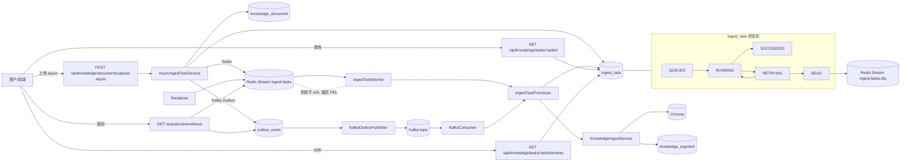
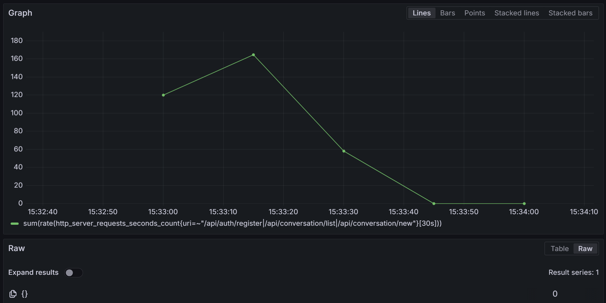

# AI 教育辅助学习系统（aismate.tech）

- 在线地址：https://aismate.tech
- 技术关键词：RAG | 流式对话 | 异步入库（Kafka + Outbox）| 可观测性（Prometheus/Grafana）| 限流/重试/熔断

## 项目亮点

- RAG 知识库问答：PDF 上传 → 分块/向量化入库（Chroma）→ 检索增强生成
- 流式对话体验：后端流式返回，前端逐段渲染
- 长任务异步化：入库任务返回 taskId，支持进度查询与事件流（SSE）
- 可靠投递设计：Kafka(KRaft) + Outbox Pattern，失败可重试、可追溯
- 可观测性：Actuator/Micrometer 指标 + Prometheus 抓取 + Grafana 看板
- 一键运行：Docker Compose 编排 MySQL/Redis/Chroma/Kafka/后端/前端/监控组件

## 异步入库链路一图（上传→入队→消费→状态机→DLQ→SSE/查询→指标）

详细图文（含时序图）：[docs/async-ingest-diagram.md](docs/async-ingest-diagram.md)



## 技术栈

- 后端：Java 17 + Spring Boot 3 + Spring Security(JWT) + JPA/MySQL + Redis + Kafka + Flyway
- AI/RAG：LangChain4j + Chroma + WebClient（对接大模型）
- 观测：Actuator + Micrometer + Prometheus + Grafana + 结构化日志
- 工程化：Docker Compose + GitHub Actions + Testcontainers

## Performance（压测基线）

- k6（20 VU / 30s）覆盖链路：注册 / 鉴权会话列表 / 创建会话
- 压测结果（端到端）：成功率 100%，吞吐 180 req/s，P95 延迟 24ms
- 观测指标（服务端）：req/s 峰值约 160+，P95 处理耗时约 9ms




## Quick Verify

### 1) 跑后端测试（包含可靠性用例）

```bash
mvn -f ai-chat/pom.xml test
```

说明：
- Docker 可用时会跑 Testcontainers 集成测试（如 Redis Streams 失败→重试→死信）。

### 2) 启动一套本地环境（Docker Compose）

```bash
docker compose up -d --build
```

启动后可访问：
- Swagger：http://localhost:8081/swagger-ui/index.html
- Prometheus：http://localhost:9090/
- Grafana：http://localhost:3000/（默认 admin/admin）

### 3) 验证可靠性与指标

- 异步入库可靠性（Redis Streams + Kafka Outbox）：[reliability.md](ai-chat/docs/reliability.md)
- Prometheus 指标：访问 `http://localhost:8081/actuator/prometheus`，检索 `ingest_task_process_total`、`ingest_stream_length`、`ingest_stream_pending`、`outbox_backlog`、`outbox_publish_total`

### 4) 证据截图（验真）

已整理 4 张“可复现/可验真”的关键截图：见 [docs/证据截图](docs/%E8%AF%81%E6%8D%AE%E6%88%AA%E5%9B%BE)。


本仓库包含一个前后端分离的 Web 应用：
- **后端**：`ai-chat/`（Spring Boot，提供鉴权、对话、知识库、错题本、题目生成、统计等 API）
- **前端**：`ai-chat-frontend/`（React + Vite，调用后端 API）

## 目录结构

```text
ai-chat/                 # Java 后端（Spring Boot）
ai-chat-frontend/        # 前端（React + Vite）
SSL_Nginx_aismate.tech_部署流程.md  # Nginx + SSL 部署记录
```

## 本地运行（快速）

### 1) 启动后端

要求：Java 17+、Maven 3.6+、MySQL、Redis（以及可选的 Chroma / 向量化与大模型相关服务）。

```bash
cd ai-chat
mvn spring-boot:run
```

默认端口：`8081`（可用环境变量 `APP_PORT` 覆盖）。

### 2) 启动前端

```bash
cd ai-chat-frontend
npm install
npm run dev -- --host
```

默认端口：`5174`。

## Docker Compose 一键启动

仓库根目录提供 `docker-compose.yml`，包含 MySQL / Redis / Chroma / Kafka / 后端 / 前端 / Prometheus / Grafana。

```bash
docker compose up -d --build
```

启动后可访问：

- 前端：http://localhost:5174/
- Swagger：http://localhost:8081/swagger-ui/index.html
- Prometheus：http://localhost:9090/
- Grafana：http://localhost:3000/（默认 admin/admin）


## 入库队列（Redis Streams / Kafka）

- 默认：Redis Streams（`INGEST_QUEUE=redis`）
- 可选：Kafka + Outbox（`INGEST_QUEUE=kafka`，并配置 `KAFKA_BOOTSTRAP_SERVERS`）

Docker Compose 默认会启用 Kafka 以便本地演示。

如果你的网络访问 Docker Hub 不稳定，可复制 `docker-compose.env.example` 为 `.env` 后再启动（会改用镜像站前缀拉取镜像）：

```bash
copy docker-compose.env.example .env
docker compose up -d --build
```

## 部署与反向代理（Nginx）

- 推荐 Nginx 托管前端静态文件，并将 `/api/` 反向代理到后端 `127.0.0.1:8081`
- HTTPS 证书与 Nginx 配置流程见：`SSL_Nginx_aismate.tech_部署流程.md`

## 文档

- 后端快速上手：`ai-chat/QUICKSTART.md`
- 后端架构说明：`ai-chat/ARCHITECTURE.md`
- 异步入库可靠性：`ai-chat/docs/reliability.md`

## Git 工作流（项目管理约定）

- 主干保护：`main` 仅允许通过 PR 合并（禁止直接 push），默认 Squash and merge
- 分支命名：
  - UI 主题：`feature/ui-theme-redesign`
  - 定向 RAG：`feature/rag-doc-scope`
  - Bug 修复：`fix/<short-desc>`
  - 文档/CI：`chore/<short-desc>`、`docs/<short-desc>`
- 提交规范：Conventional Commits（如 `feat:` / `fix:` / `docs:` / `test:` / `db:`）
- PR 要求：描述包含变更概览、验证方式、影响范围/回滚、截图/录屏（UI 变更必需）；CI 通过后再合并
- Release：语义化版本；`v0.3.0` 用于“RAG 知识库问答”等用户可见功能
- 安全：禁止提交 `.env`、密钥、token、证书等敏感文件；README 示例 Key 必须使用占位符（如 `YOUR_API_KEY`）
