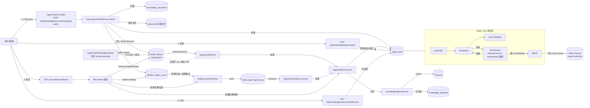
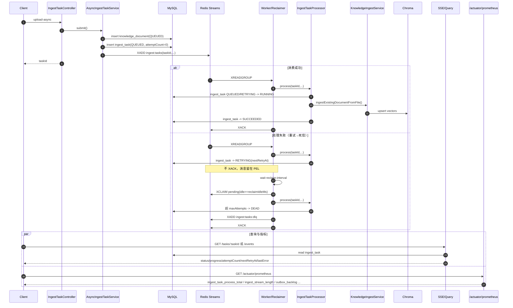

# 异步入库链路一图（上传 → 入队 → 消费 → 状态机 → DLQ → SSE/查询 → 指标）

> 说明：本图对应仓库实际实现（Spring Boot 3 + JPA/MySQL + Redis Streams + Kafka Outbox + Micrometer）。

## 总览（架构 + 状态机 + DLQ + SSE + 指标）

```mermaid
flowchart LR
  %% Client
  U[用户/前端] -->|1. 上传 async| API[IngestTaskController<br/>POST /api/knowledge/documents/upload-async]
  U -->|7. 查询| Q1[GET /api/knowledge/tasks/:taskId]
  U -->|8. SSE| Q2[GET /api/knowledge/tasks/:taskId/events]
  U -->|9. 指标| M1[GET /actuator/prometheus]

  %% Submit + Persist
  API --> SVC[AsyncIngestTaskService.submit]
  SVC -->|创建| DOC[(knowledge_document)]
  SVC -->|创建| TASK[(ingest_task)]
  SVC -->|保存文件| FS[(upload-dir 本地文件)]

  %% Enqueue (two modes)
  SVC -->|入队: Redis Streams| RS[(Redis Stream<br/>ingest:tasks)]
  SVC -->|入队: Kafka Outbox| OB[(MySQL outbox_event)]

  %% Redis Streams consume path
  RS -->|XREADGROUP| W1[IngestTaskWorker]
  W1 -->|处理| P[IngestTaskProcessor]
  W1 -.失败不 ack, 留在 PEL.- RS
  RC[IngestTaskPendingReclaimer<br/>定时 reclaim pending] -->|XCLAIM + 重试| RS

  %% Kafka outbox publish + consume path
  OB -->|到期扫描 + 退避重试| PUB[KafkaOutboxPublisher]
  PUB -->|send| K[(Kafka topic ingest-tasks)]
  K -->|consume| KC[IngestTaskKafkaConsumer]
  KC -->|处理| P

  %% Ingest processing
  P -->|入库| ING[KnowledgeIngestService]
  ING -->|upsert| CH[(Chroma)]
  ING -->|写分段| SEG[(knowledge_segment)]

  %% Task state machine (DB)
  subgraph SM[ingest_task 状态机]
    QUEUED[QUEUED] --> RUNNING[RUNNING]
    RUNNING --> SUCCEEDED[SUCCEEDED]
    RUNNING -->|失败| RETRYING[RETRYING<br/>attemptCount+1<br/>nextRetryAt=退避]
    RETRYING -->|到期| RUNNING
    RETRYING -->|超 maxAttempts| DEAD[DEAD]
  end

  TASK --- SM
  P -->|更新状态/进度| TASK

  %% DLQ
  DEAD -->|写入 DLQ stream| DLQ[(Redis Stream<br/>ingest:tasks:dlq)]

  %% Query / SSE read DB
  Q1 -->|读| TASK
  Q2 -->|轮询读| TASK

  %% Metrics
  M1 --> METRICS[Micrometer 指标]
  METRICS -->|stream length/pending| RS
  METRICS -->|outbox backlog| OB
  METRICS -->|处理结果/耗时| P
  METRICS -->|发布结果/延迟| PUB
```

## 时序（更偏“发生了什么”）

```mermaid
sequenceDiagram
  autonumber
  participant C as Client
  participant API as IngestTaskController
  participant S as AsyncIngestTaskService
  participant DB as MySQL
  participant R as Redis Streams
  participant W as Worker/Reclaimer
  participant P as IngestTaskProcessor
  participant K as KnowledgeIngestService
  participant V as Chroma
  participant SSE as SSE/Query
  participant M as /actuator/prometheus

  C->>API: upload-async
  API->>S: submit()
  S->>DB: insert knowledge_document(QUEUED)
  S->>DB: insert ingest_task(QUEUED, attemptCount=0)
  S->>R: XADD ingest:tasks(taskId,...)
  API-->>C: taskId

  alt 消费成功
    R->>W: XREADGROUP
    W->>P: process(taskId,...)
    P->>DB: ingest_task QUEUED/RETRYING -> RUNNING
    P->>K: ingestExistingDocumentFromFile()
    K->>V: upsert vectors
    P->>DB: ingest_task -> SUCCEEDED
    W->>R: XACK
  else 处理失败（重试→死信）
    R->>W: XREADGROUP
    W->>P: process(taskId,...)
    P->>DB: ingest_task -> RETRYING(nextRetryAt)
    Note over W,R: 不 XACK，消息留在 PEL
    W->>W: wait reclaim-interval
    W->>R: XCLAIM pending(idle>=reclaimIdleMs)
    W->>P: process(taskId,...)
    P->>DB: 超 maxAttempts -> DEAD
    W->>R: XADD ingest:tasks:dlq
    W->>R: XACK
  end

  par 查询与指标
    C->>SSE: GET /tasks/:taskId 或 /events
    SSE->>DB: read ingest_task
    SSE-->>C: status/progress/attemptCount/nextRetryAt/lastError
  and
    C->>M: GET /actuator/prometheus
    M-->>C: ingest_task_process_total / ingest_stream_length / outbox_backlog ...
  end
```
